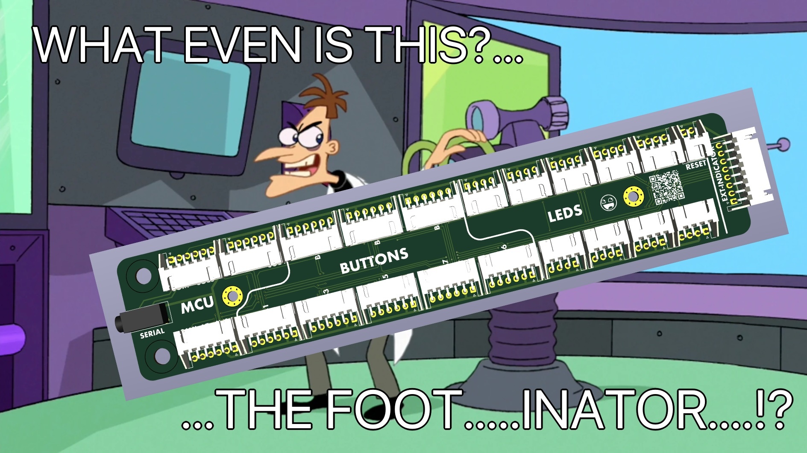
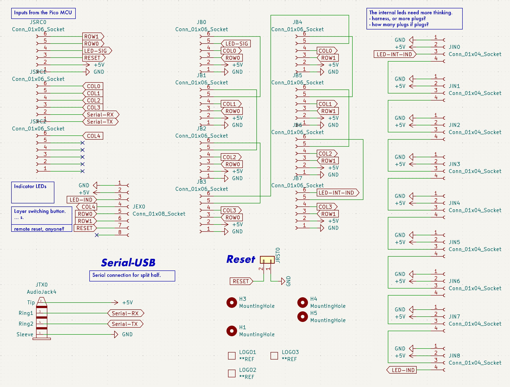
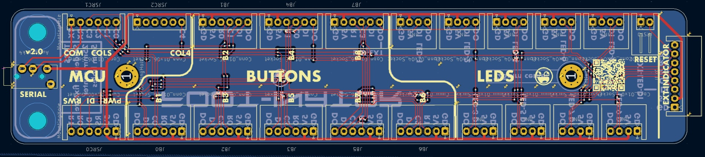

# Overview
A breakout pcb that helps make pedal wiring less nightmarish.  Intended to be used with these: https://github.com/christrotter/microswitch-pcb

I needed a cleaner way of wiring up my pedals, and now that I know how to make basic pcbs...well, for the price, hard to go back to janky prototyping boards.

Don't mind the renders, it's meant to utilize JST-XH horizontal connectors pointed inwards to minimize the room needed for cable routing space.
- This is meant to be super simple - just a breakout pcb
- TRRS PB-320A footprint wired up for full-duplex serial
- JST-XH 8-pin for your external indicator module
  - 2x buttons
  - LED in
  - +5V/GND
  - Reset
- 3x JST-XH 6-pin for MCU row/col, led, power/gnd, reset, serial, etc
- 1x 2-pin for reset
- 8x JST-XH 6-pin for button PCB connectivity
  - +5V/GND
  - LED IN/OUT
  - ROW & COL
- 8x JST-XH 4-pin for any internal LED necessities
  - +5V/GND
  - LED IN/OUT

I was going to do the whole nine yards and put in serial power protection and data esd, led signal up-convert, and more...but PCBA + shipping would end up being $60-80.  This design ended up being $19 shipped (_then an $8 coupon brought it down to $11 shipped_).

# Schematic

# PCB layout

